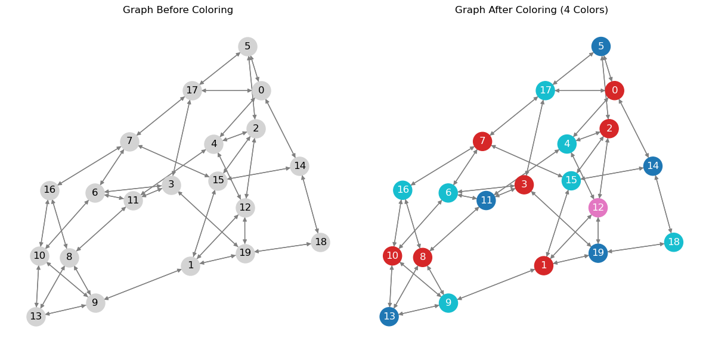

# Unsupervised Graph Coloring using Gated Graph Neural Network

<p align="center">
  
</p>

In this repo, we show the unsupervised graph coloring method using gated graph neural network applied for frequency allocation in wireless multicellular system in the paper [D. Abode, R. Adeogun, L. Salaün, R. Abreu, T. Jacobsen and G. Berardinelli, "Unsupervised Graph-based Learning Method for Sub-band Allocation in 6G Subnetworks," 2024 IEEE 100th Vehicular Technology Conference (VTC2024-Fall), Washington, DC, USA, 2024, pp. 1-6, doi: 10.1109/VTC2024-Fall63153.2024.10757647](https://arxiv.org/abs/2401.00950)

Please note the `requirements.txt` file, which defines the environment required to run this code

If you find the code useful, kindly cite the corresponding paper -

## Citation

```

@INPROCEEDINGS{10757647,\
  author={Abode, Daniel and Adeogun, Ramoni and Salaün, Lou and Abreu, Renato and Jacobsen, Thomas and Berardinelli, Gilberto}, \
  booktitle={2024 IEEE 100th Vehicular Technology Conference (VTC2024-Fall)}, \
  title={Unsupervised Graph-based Learning Method for Sub-band Allocation in 6G Subnetworks}, \
  year={2024}, \
  pages={1-6}, \
  doi={10.1109/VTC2024-Fall63153.2024.10757647}\
  }

```


Instructions for setting up the environment and installing dependencies

1. Create a new conda environment (replace `myenv` with your desired environment name)
    You can specify Python version if needed, for example, `python=3.11` for Python 3.11
   conda create -n myenv python=3.11

2. Activate the conda environment
    conda activate myenv

3. Install dependencies using pip
    Ensure pip is up-to-date in the environment: conda install pip

4. Install the required packages from this file
    pip install -r requirements.txt

networkx==3.1
torch==2.1.0
torch-geometric==2.5.2
numpy==1.26.0
matplotlib
